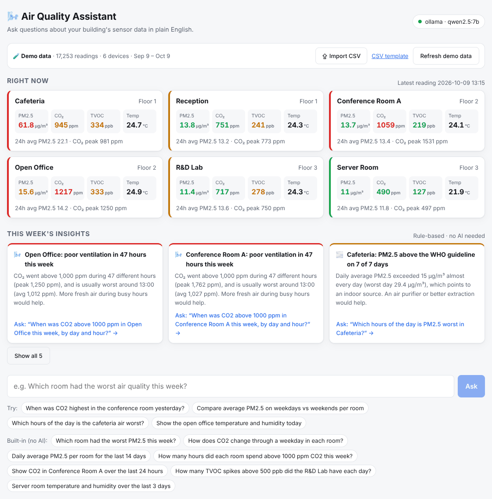
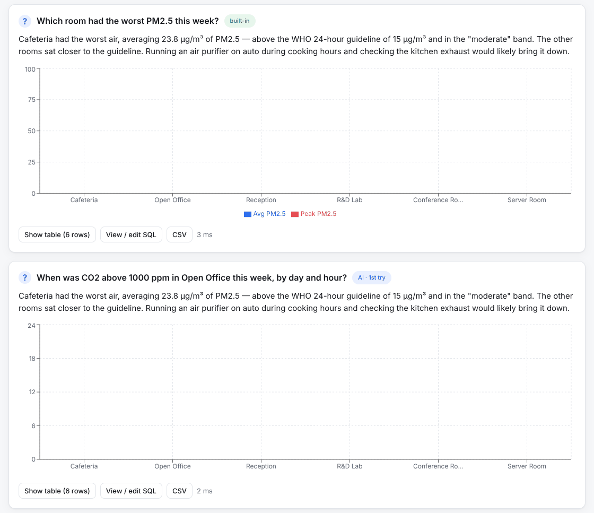
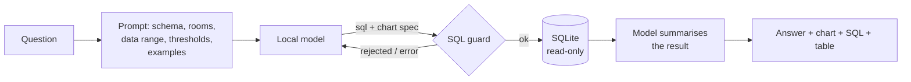

# 🌬️ Air Quality Assistant

Ask questions about indoor air-quality sensor data in plain English — *"When was CO2 highest in the conference room yesterday?"* — and get a short answer, a chart, and the SQL behind it.

**Runs on a local AI model by default** (Ollama). Built-in questions, live room cards and the SQL editor work with no AI at all.




## Features

- **Text-to-SQL with self-correction:** the model writes SQLite for your question; if the query fails, the error goes back to the model and it fixes it (up to 3 attempts).
- **Safe by design:** generated SQL is checked (single `SELECT`/`WITH` statement, no write or admin keywords, comments and string literals handled), SQLite confirms the statement is read-only, it runs on a **read-only connection**, and results are capped.
- **Charts picked by the model:** line for time series, bar for comparisons, with automatic pivoting so each room becomes its own series.
- **Follow-up questions** keep context ("now only weekdays").
- **Plain-English answers** compared against WHO / ventilation thresholds, with a practical recommendation — streamed in after the chart appears.
- **Weekly insights (no AI):** hours of poor ventilation and when CO₂ peaks, rooms with a chronic PM2.5 source vs building-wide pollution days, unusual spikes (robust median/MAD baseline per room and hour of day), and sensor health — silent devices, data gaps and stuck values. Each insight has a one-click follow-up question.
- **Bring your own data:** import a CSV exported from your sensors (see below).
- **Transparent:** view and edit the SQL, re-run it, see the table, download CSV.
- **Works offline:** 7 built-in questions run without AI; the "Right now" room cards are plain SQL.
- **Realistic demo data:** 30 days × 6 rooms at 15-minute intervals (~17,000 readings) with occupancy-driven CO2, cafeteria cooking spikes, lab solvent TVOC events, outdoor pollution days and sensor dropouts. Regenerated automatically when stale.



<sub>Screenshots use the built-in demo data.</sub>

## How it works



"Now" is anchored to the latest reading (`datetime((SELECT MAX(ts) FROM readings), '-7 days')`), so relative questions work on any dataset, including your own.

## Quick start

**Requirements:** Node.js 20+ and [Ollama](https://ollama.com).

```bash
ollama pull qwen2.5:7b     # good at SQL and JSON; ≈4.7 GB
npm run setup
npm run dev
```

Open http://localhost:5172.

> Want stronger SQL from a local model? Try `qwen2.5-coder:7b` and set `LLM_MODEL` in `server/.env`.

### Production

```bash
npm run build && npm start       # http://localhost:3002
# or
docker compose up -d && docker compose exec ollama ollama pull qwen2.5:7b
```

## Using your own data

Click **Import CSV** (or `POST /api/import`). Headers are matched loosely, so most exports work as-is:

| Field | Accepted headers (examples) |
|---|---|
| Time | `timestamp`, `time`, `datetime`, `created_at` — ISO 8601, `YYYY-MM-DD HH:MM`, `DD/MM/YYYY HH:MM`, Unix seconds or ms |
| Room / device | `room`, `location`, `zone` and/or `device_id`, `sensor`, `serial` |
| Readings | `pm25` / `PM2.5 (µg/m³)`, `pm10`, `co2` / `CO2 ppm`, `tvoc` / `voc`, `temperature` / `temp`, `humidity` / `rh` |

Comma, semicolon and tab separated files all work, decimal commas too. Rows with unreadable timestamps are skipped and reported, and obviously broken values (CO₂ below 250 ppm, humidity over 100%) are ignored. Download a template from the app or `GET /api/import/template`. Imported data is kept until you choose **Back to demo data**.

You can also point `DB_PATH` at your own SQLite file with this schema:

```sql
devices(id, name, room, floor, zone)
readings(id, device_id, ts 'YYYY-MM-DD HH:MM:SS' local time, pm25, pm10, co2, tvoc, temperature, humidity)
```

Set `TZ_OFFSET_MINUTES` if your timestamps aren't IST.

## Switching AI provider

Set `LLM_PROVIDER` in `server/.env`: `ollama` (default), `openai` (any OpenAI-compatible endpoint), `anthropic`, or `none`. See `server/.env.example`.

## API

| Method | Path | Notes |
|---|---|---|
| `POST` | `/api/ask` | `{ question, history? }` → SQL, rows, chart spec |
| `POST` | `/api/summarize` | `{ question, columns, rows }` → NDJSON stream of the plain-English answer |
| `GET` | `/api/insights` | Rule-based weekly insights (no AI) |
| `POST` | `/api/import` · `GET /api/import/template` · `GET /api/data-source` | CSV import and current data info |
| `GET` | `/api/presets` · `POST /api/presets/:id` | Built-in questions (no AI) |
| `POST` | `/api/sql` | Run edited SQL (same read-only guard) |
| `GET` | `/api/overview` | Latest reading + 24h stats per room |
| `GET` | `/api/schema` · `POST /api/reseed` | Schema text · back to fresh demo data |

## Scripts

`npm run dev` · `npm run build` · `npm start` · `npm test` · `npm --prefix server run seed`

## License

MIT © Faisal
